# Rapport de Projet

# Pipeline ETL et Analyses de Données avec Apache Spark

**Étudiants :** Nessrine BOUZRINA & Melissa DJABELLA

---

# Table des matières

1. Introduction
2. Présentation du jeu de données
3. Architecture du pipeline
4. Étape 1 : Ingestion et nettoyage des données
5. Étape 2 : Analyses Silver → Gold
6. Optimisations Spark
7. Analyse de la Spark UI
8. Exploration 1 : Partition Pruning
9. Exploration 2 : UDF vs Fonction Native
10. Bonus MLlib
11. Conclusion

---

# 1. Introduction

L'objectif de ce projet est de concevoir un pipeline ETL complet avec Apache Spark afin de traiter le jeu de données MovieLens, produire plusieurs analyses métier et étudier les performances du moteur Spark à travers différentes optimisations et explorations.

Le projet repose sur le jeu de données **MovieLens**, composé de plusieurs fichiers CSV contenant des informations sur des films ainsi que les notes attribuées par les utilisateurs.

L'ensemble du pipeline suit une architecture de type **Bronze → Silver → Gold** :

```
CSV (Bronze)
        │
        ▼
Nettoyage des données
        │
        ▼
Parquet (Silver)
        │
        ▼
Analyses Spark
        │
        ▼
Gold
```

Le pipeline comporte les étapes suivantes :

- ingestion des fichiers CSV ;
- nettoyage des données ;
- écriture de la couche Silver au format Parquet ;
- réalisation de trois analyses métier ;
- optimisation des traitements Spark ;
- étude de la Spark UI ;
- explorations complémentaires ;
- bonus avec MLlib.

---

# 2. Présentation du jeu de données

Le projet utilise le dataset **MovieLens**.

Ce dataset est couramment utilisé dans les projets de Data Science afin d'étudier les systèmes de recommandation.

Il contient quatre fichiers principaux :

| Fichier | Description |
|----------|-------------|
| movies.csv | informations sur les films |
| ratings.csv | notes attribuées par les utilisateurs |
| tags.csv | mots-clés ajoutés par les utilisateurs |
| links.csv | identifiants externes (IMDb et TMDB) |

Les données brutes sont stockées dans le dossier :

```text
data/raw/
```
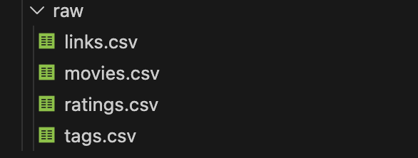

Les analyses réalisées dans ce projet reposent principalement sur les tables **ratings** et **movies**.

La table **ratings** contient les notes attribuées aux films tandis que la table **movies** contient les titres ainsi que les genres associés à chaque film.

---

# 3. Architecture du pipeline

Le pipeline suit une architecture en trois couches.

## Bronze

Les données d'origine sont stockées au format CSV.

Aucune transformation n'est appliquée à cette étape.

Emplacement :

```text
data/raw/
```

---

## Silver

Les données sont nettoyées puis enregistrées au format Parquet.

Les principales opérations réalisées sont :

- suppression des doublons ;
- suppression des valeurs manquantes ;
- contrôle des valeurs aberrantes ;
- ajout de nouvelles colonnes ;
- partitionnement des tables.

Emplacement :

```text
data/output/silver/
```

Les tables **ratings** et **tags** sont partitionnées par année afin d'améliorer certaines lectures.

---

## Gold

La couche Gold contient uniquement les résultats d'analyse.

Trois jeux de résultats sont produits :

- top_rated_movies
- top_rated_movies_with_titles
- top_movies_by_genre

Ces résultats sont enregistrés dans :

```text
data/output/gold/
```

---

# 4. Étape 1 : Ingestion et nettoyage des données

L'ensemble des fichiers CSV est chargé avec un schéma explicite (`StructType`).

L'utilisation d'un schéma explicite présente plusieurs avantages :

- meilleure maîtrise des types de données ;
- chargement plus rapide qu'avec `inferSchema` ;
- réduction des erreurs liées aux conversions automatiques.

Les figures suivantes présentent les schémas explicitement définis lors du chargement des fichiers CSV.

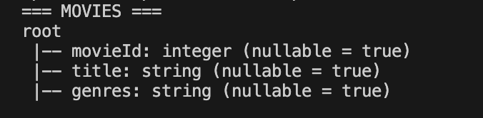

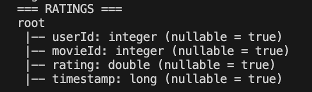

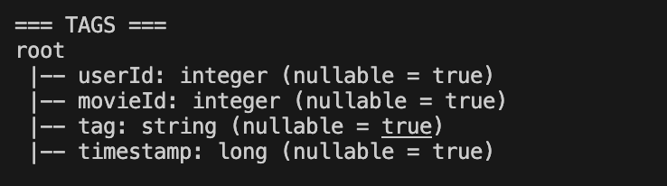

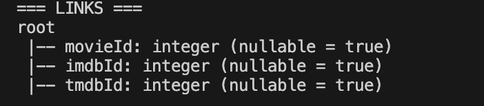

Après l'ingestion, plusieurs traitements de nettoyage sont appliqués.

Les principales opérations sont :

- suppression des doublons ;
- suppression des lignes contenant des valeurs manquantes ;
- suppression des notes invalides (inférieures à 0.5 ou supérieures à 5) ;
- création d'une colonne contenant la date ;
- création d'une colonne contenant l'année ;
- normalisation des tags.

Les données nettoyées sont ensuite enregistrées au format Parquet dans la couche Silver.

### Données Silver générées

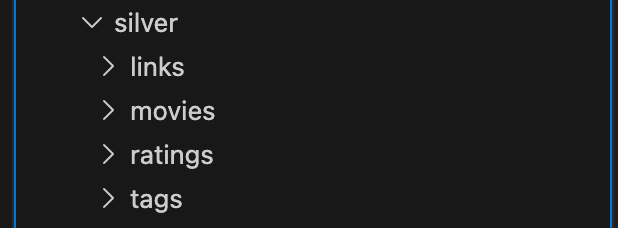

Le format Parquet est particulièrement adapté aux traitements Spark car il permet une lecture plus rapide ainsi qu'une meilleure compression des données.


### Résultat du nettoyage

Le tableau suivant compare le nombre de lignes avant et après les opérations de nettoyage.

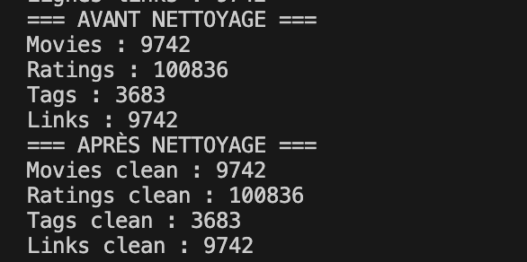

Les opérations de nettoyage n'ont supprimé aucune ligne du jeu de données. Aucun doublon, aucune valeur manquante et aucune note invalide n'ont été détectés dans les fichiers MovieLens utilisés. Les jeux de données conservent donc le même nombre de lignes avant et après le nettoyage.

# 5. Étape 2 : Analyses Silver → Gold

Les analyses sont réalisées uniquement à partir des données de la couche **Silver**, c'est-à-dire les fichiers Parquet nettoyés.

Cette approche permet d'éviter de retraiter les fichiers CSV à chaque exécution et garantit que toutes les analyses utilisent des données propres.

Les résultats produits sont enregistrés dans la couche **Gold**.

---

## Analyse 1 : Top Rated Movies

### Objectif

Identifier les films les mieux notés par les utilisateurs.

Afin d'obtenir un classement fiable, seuls les films ayant reçu **au moins 50 votes** sont conservés.

```python
top_rated_movies = (
        ratings
        .groupBy("movieId")
        .agg(
            F.count("*").alias("nb_votes"),
            F.round(F.avg("rating"), 2).alias("note_moyenne")
        )
        .filter(F.col("nb_votes") >= 50)
        .orderBy(F.desc("note_moyenne"), F.desc("nb_votes"))
    )

    print("=== Analyse 1 : top_rated_movies ===")
    top_rated_movies.show(20, truncate=False)
```

Le résultat contient pour chaque film :

- son identifiant ;
- le nombre de votes ;
- sa note moyenne.

Cette analyse répond à la question métier suivante :

> Quels sont les films les mieux évalués par les utilisateurs tout en disposant d'un nombre suffisant de votes ?

Le résultat est enregistré dans :

```text
top_rated_movies
```

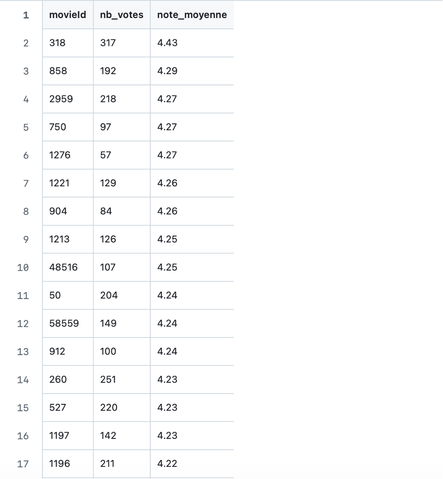

---

## Analyse 2 : Top Rated Movies With Titles and Genres

### Objectif

Associer les titres et les genres aux films identifiés lors de la première analyse.

Une jointure est réalisée entre :

- la table `ratings` agrégée ;
- la table `movies`.

Comme la table `movies` est beaucoup plus petite que `ratings`, elle est diffusée grâce à la fonction :

```python
F.broadcast(movies)
```

Cette optimisation évite un shuffle important et accélère la jointure.


```python
debut = time.time()

top_rated_movies_with_titles = (
        top_rated_movies
        .join(
            F.broadcast(movies),
            on="movieId",
            how="inner"
        )
        .select(
            "movieId",
            "title",
            "genres",
            "nb_votes",
            "note_moyenne"
        )
        .orderBy(F.desc("note_moyenne"), F.desc("nb_votes"))
    )

    top_rated_movies_with_titles.count()

    fin = time.time()
    print("Temps de la jointure avec Broadcast :", round(fin - debut, 2), "secondes")

    top_rated_movies_with_titles.explain()

    print("=== Analyse 2 : top_rated_movies_with_titles ===")
    top_rated_movies_with_titles.show(20, truncate=False)
```

Le résultat obtenu contient :

- le titre du film ;
- son genre ;
- le nombre de votes ;
- sa note moyenne.

Cette analyse répond à la question métier suivante :

> Quels sont les meilleurs films avec leurs informations descriptives ?

Le résultat est enregistré dans :

```text
top_rated_movies_with_titles
```

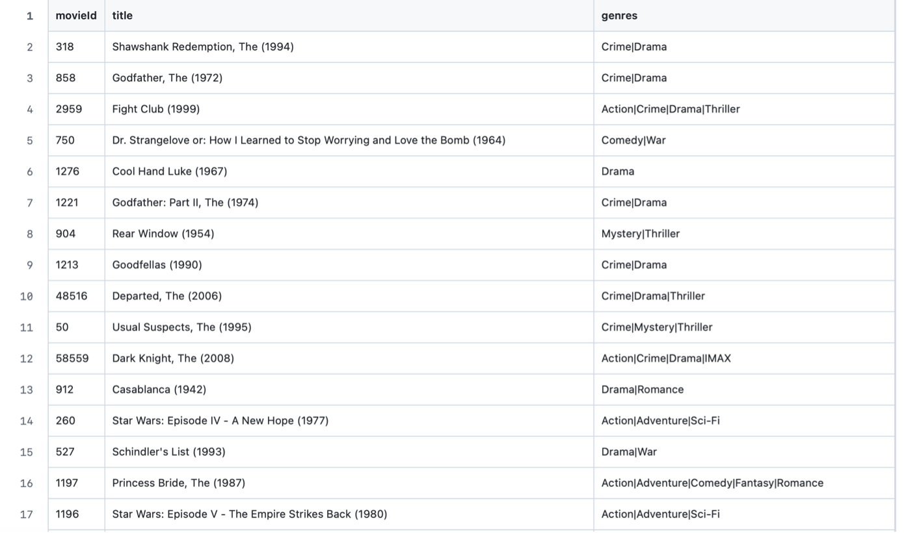

---

## Analyse 3 : Top Movies By Genre

### Objectif

Identifier les trois meilleurs films pour chaque genre.

Les genres étant stockés sous forme de chaîne de caractères séparée par le caractère `|`, ils sont d'abord séparés grâce à :

```python
films_genres = (
    top_rated_movies_with_titles
    .withColumn(
        "genre",
        F.explode(F.split("genres", "\\|"))
    )
)

fenetre = Window.partitionBy("genre").orderBy(
    F.desc("note_moyenne")
)

top_movies_by_genre = (
    films_genres
    .withColumn("rang",
        F.row_number().over(fenetre))
)
   
```

Chaque genre conserve uniquement les trois films les mieux classés.

Cette analyse répond à la question métier suivante :

> Quels sont les meilleurs films pour chaque catégorie cinématographique ?

Le résultat est enregistré dans :

```text
top_movies_by_genre
```
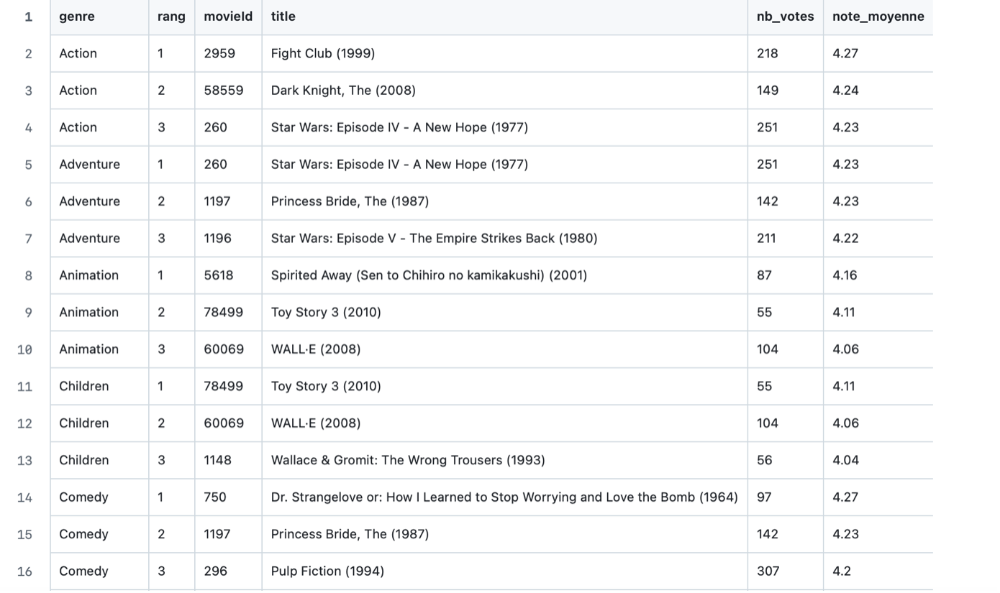


---

## Résumé des analyses

| Analyse | Technique Spark utilisée |
|----------|--------------------------|
| Top Rated Movies | Agrégation (`groupBy`, `count`, `avg`) |
| Top Rated Movies With Titles | Jointure (`join`, `broadcast`) |
| Top Movies By Genre | Window Function (`Window`, `row_number`) |

Ces trois analyses permettent de couvrir les principales opérations demandées dans le projet.

---

# 6. Optimisations Spark

L'objectif n'était pas uniquement de produire des analyses, mais également d'améliorer leurs performances.

Deux optimisations principales ont été utilisées.

---

## 6.1 Cache

Le DataFrame **ratings** est utilisé plusieurs fois dans le pipeline.

Afin d'éviter sa relecture à chaque analyse, il est placé en mémoire grâce à :

```python
ratings.cache()
```

La présence du DataFrame dans l'onglet Storage de la Spark UI confirme que le cache a bien été pris en compte par Spark.

Le cache est ensuite matérialisé avec :

```python
ratings.count()
```

Cette optimisation réduit le temps d'exécution lorsque le DataFrame est réutilisé plusieurs fois.

---

## 6.2 Broadcast Join

La table **movies** contient beaucoup moins de lignes que la table **ratings**.

Spark peut donc envoyer automatiquement cette petite table sur tous les exécutants afin d'éviter une jointure coûteuse.

Dans ce projet, le broadcast est forcé avec :

```python
F.broadcast(movies)
```

Le plan d'exécution affiche notamment les opérateurs BroadcastExchange et BroadcastHashJoin, confirmant que Spark a utilisé une jointure optimisée.

---

# 7. Analyse de la Spark UI

La Spark UI a été utilisée tout au long du projet afin d'observer le comportement interne de Spark.

Adresse utilisée :

```text
http://localhost:4040
```

Les captures suivantes illustrent les différentes étapes d'exécution du pipeline.

---

## 7.1 Jobs

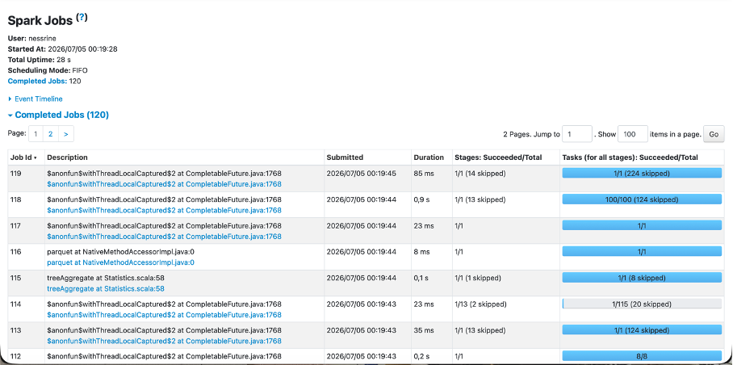

Cette vue présente l'ensemble des jobs exécutés par Spark pendant le pipeline. Chaque action (lecture, écriture, analyse ou exploration) déclenche un nouveau job.

---

## 7.2 Stages

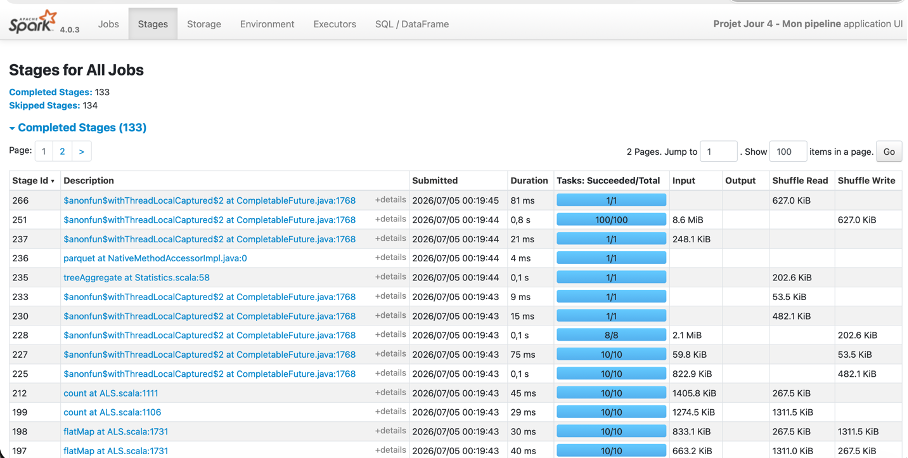

Les stages représentent les différentes étapes d'exécution des jobs. Ils permettent notamment d'observer les opérations de shuffle ainsi que la répartition des tâches entre les exécutants.

---

## 7.3 DAG Visualization

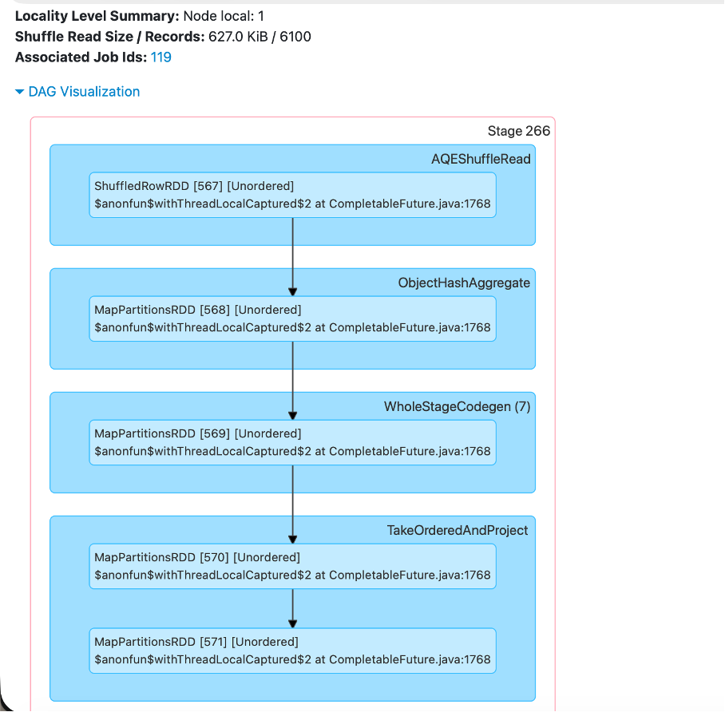

Le DAG représente les différentes transformations exécutées par Spark ainsi que leurs dépendances. Il met en évidence les opérations de lecture, d'agrégation, de jointure et d'écriture.

## 7.4 Storage

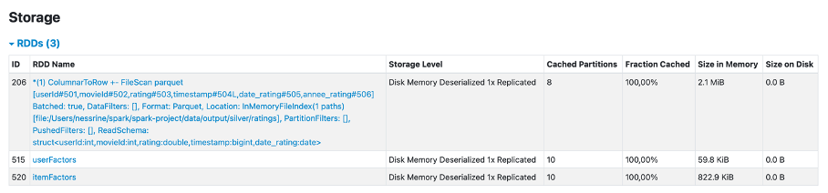

Cette capture montre que le DataFrame ratings est correctement mis en cache grâce à l'appel à cache(). Cette optimisation évite de relire plusieurs fois les mêmes données.

---

## 7.5 SQL / DataFrame

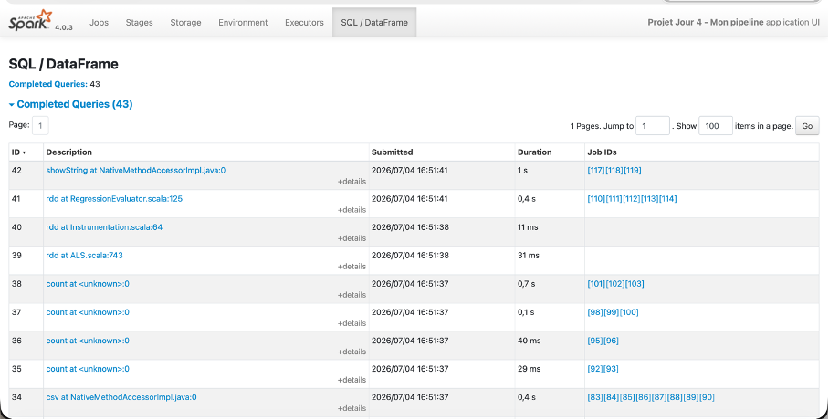

Le plan d'exécution confirme l'utilisation des optimisations implémentées dans le pipeline, notamment BroadcastExchange, BroadcastHashJoin ainsi que les agrégations HashAggregate.


# 8. Exploration 1 : Partition Pruning sur Parquet

L'une des explorations demandées consistait à mesurer l'impact du **partition pruning** sur une table Parquet partitionnée.

La table **ratings** a été partitionnée selon la colonne `annee_rating`.

Deux lectures ont été comparées :

- lecture complète de la table ;
- lecture filtrée sur une année (`annee_rating = 2018`).

Les temps obtenus sont les suivants :

| Lecture | Nombre de lignes | Temps |
|----------|-----------------:|------:|
| Sans filtre | 100836 | 0.07 s |
| Avec filtre (`annee_rating = 2018`) | 6418 | 0.09 s |

La capture suivante présente les temps d'exécution obtenus lors de la comparaison entre une lecture complète et une lecture filtrée sur une partition.

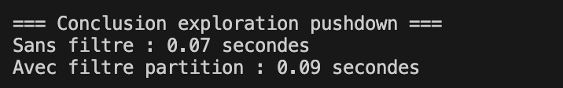

Le plan d'exécution a également été étudié afin d'observer le comportement de Spark lors de la lecture des données partitionnées.

Cette exploration consistait à comparer une lecture complète de la table `ratings` avec une lecture filtrée sur la partition `annee_rating = 2018`.

Les mesures obtenues montrent que la lecture filtrée est légèrement plus lente (0,09 s) que la lecture complète (0,07 s), alors qu'elle ne lit que 6 418 lignes contre 100 836 pour la lecture sans filtre.

Ce résultat peut paraître contre-intuitif, mais il s'explique par la faible taille du jeu de données MovieLens. Sur un volume aussi réduit, le coût fixe de démarrage et de planification du job Spark est plus important que le gain apporté par le partition pruning. En revanche, sur des jeux de données beaucoup plus volumineux, cette optimisation permet généralement de limiter les données lues et d'améliorer les performances.
---

# 9. Exploration 2 : UDF Python vs Fonction Native Spark

La deuxième exploration consistait à comparer deux méthodes permettant de réaliser exactement la même transformation.

La transformation consiste à créer une nouvelle colonne appelée `rating_category` :

- **positive** si la note est supérieure ou égale à 4 ;
- **other** sinon.

Deux implémentations ont été testées :

- une fonction native Spark (`when`) ;
- une UDF Python.

Les résultats obtenus sont les suivants :

| Méthode | Temps |
|----------|------:|
| Fonction native Spark | 0.12 s |
| UDF Python | 0.73 s |

La capture suivante montre les temps mesurés pour les deux implémentations.
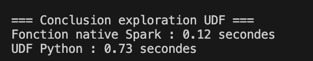

L'analyse du plan d'exécution montre que la fonction native est directement optimisée par Spark.

À l'inverse, la version UDF fait apparaître l'opérateur :

```text
BatchEvalPython
```

Cela signifie que Spark doit exécuter une partie du traitement dans l'interpréteur Python, ce qui ajoute un coût supplémentaire.

Cette exploration montre que les fonctions natives Spark doivent être privilégiées dès que cela est possible. Les UDF restent utiles lorsqu'une logique métier complexe ne peut pas être exprimée avec les fonctions natives.

---

# 10. Bonus : Système de recommandation avec MLlib

Afin d'aller au-delà des objectifs du projet, un mini système de recommandation a été développé avec **Spark MLlib**.

Le modèle utilisé est **ALS (Alternating Least Squares)**, un algorithme de filtrage collaboratif couramment utilisé pour les systèmes de recommandation.

Le modèle est entraîné à partir des colonnes :

- `userId`
- `movieId`
- `rating`

Les données sont séparées en :

- 80 % pour l'entraînement ;
- 20 % pour le test.

Les performances obtenues sont :

```text
Temps d'entraînement + évaluation : 3.04 secondes
RMSE : 0.8764
```

Le RMSE (Root Mean Squared Error) mesure l'écart entre les notes réelles et les notes prédites par le modèle.

Plus cette valeur est faible, plus les prédictions sont proches des notes réelles.

Une fois entraîné, le modèle génère automatiquement les trois meilleures recommandations pour chaque utilisateur.

Les identifiants des films sont ensuite remplacés par leurs titres grâce à une jointure avec la table `movies`.

### Exemple de recommandations générées

Après l'entraînement du modèle ALS, Spark génère automatiquement plusieurs recommandations de films pour chaque utilisateur. La capture suivante présente un extrait des recommandations produites, avec le titre du film, son genre et le score prédit.

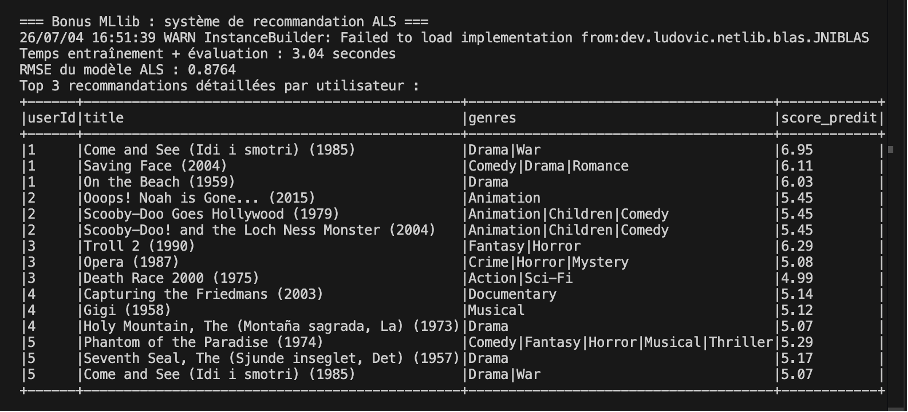

Le score prédit représente une préférence estimée par le modèle et non une note réelle. Il peut donc dépasser légèrement la note maximale de 5.

Cette partie montre comment Spark MLlib peut être utilisé pour développer rapidement un système de recommandation à partir des données utilisateurs.

---

# 11. Conclusion

Ce projet nous a permis de mieux comprendre le fonctionnement d'Apache Spark, les optimisations proposées par le moteur ainsi que la construction d'un pipeline ETL complet. Nous avons également constaté que certaines optimisations, comme le partition pruning, apportent peu de gain sur un jeu de données de petite taille mais deviennent essentielles sur des volumes plus importants. Une amélioration possible serait de tester le pipeline sur un dataset plus volumineux ou dans un environnement distribué afin d'observer un impact plus significatif des optimisations.

Enfin, le bonus réalisé avec Spark MLlib montre que la plateforme peut être utilisée non seulement pour le traitement distribué des données mais également pour l'entraînement de modèles de Machine Learning.

